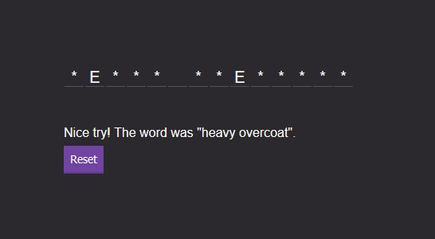

# Hangman Application on Javascript
 Hangman App completely built on Javascript 
 
 
 
 
The general syntax of the Index.html file contains the following Javascript files 

- Requests 
- Hangman
- App

- George Washington
- John Adams
- Thomas Jefferson
 
Volley offers the following benefits:

- Automatic scheduling of network requests.
- Multiple concurrent network connections.
- Transparent disk and memory response caching with standard HTTP cache coherence.
- Support for request prioritization.
- Cancellation request API. You can cancel a single request, or you can set blocks or scopes of requests to cancel.

